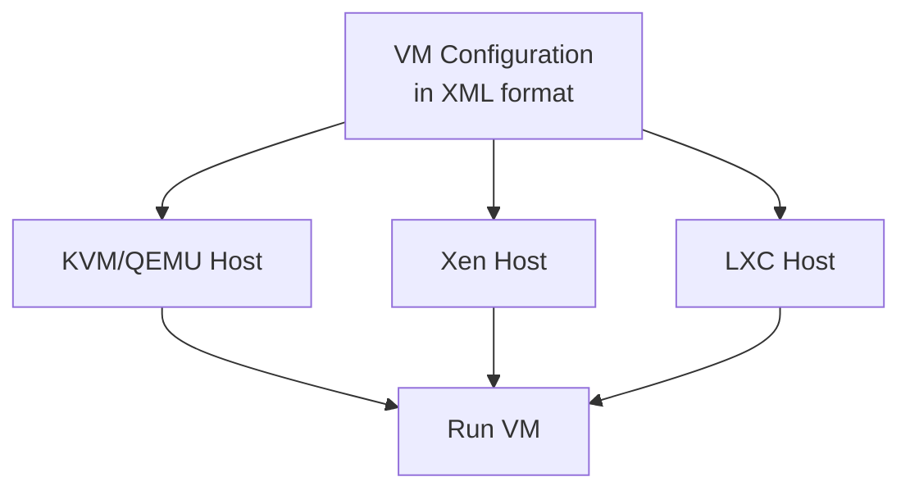

# CLOUD-COMPUTING

# Hardware Virtualization and Libvirt: A Technical Guide

## Hardware Virtualization

**Hardware Virtualization** (also known as **platform virtualization**) is a technology that allows multiple isolated virtual machines (VMs) to run on a single physical host computer. It creates a **virtualized hardware environment** where guest operating systems can execute as if they were running on real physical hardware.

### Role in Cloud Computing

In cloud computing, hardware virtualization is **fundamental** because it enables:

- **Resource Pooling**: Physical resources (CPU, memory, storage) are abstracted and shared among multiple tenants
- **Isolation**: Each virtual machine operates independently, with no awareness of other VMs on the same host
- **Elasticity**: VMs can be easily created, migrated, or destroyed based on demand
- **Multi-tenancy**: Different customers/organizations can share the same physical infrastructure securely

```
+---------------------------------------------------------------+
|                    Physical Server                            |
|  +------------------+  +------------------+                   |
|  |   Virtual Machine|  |   Virtual Machine|                   |
|  | +--------------+ |  | +--------------+ |                   |
|  | | Guest OS &   | |  | | Guest OS &   | |                   |
|  | | Applications | |  | | Applications | |                   |
|  | +--------------+ |  | +--------------+ |                   |
|  | | Virtualized  | |  | | Virtualized  | |                   |
|  | | Hardware     | |  | | Hardware     | |                   |
|  | +--------------+ |  | +--------------+ |                   |
|  +------------------+  +------------------+                   |
|  +-------------------------------------------------------+    |
|  |                 Hypervisor / VMM                      |    |
|  +-------------------------------------------------------+    |
|  +-------------------------------------------------------+    |
|  |                 Physical Hardware                     |    |
|  | (CPU, Memory, Storage, Network Interfaces)           |    |
|  +-------------------------------------------------------+    |
+---------------------------------------------------------------+
```

## The Hypervisor (Virtual Machine Monitor)

The **Hypervisor** or **Virtual Machine Monitor (VMM)** is the software layer that creates and runs virtual machines. Its primary functions are:

- **Resource Virtualization**: Presents virtualized hardware to guest OSes
- **Isolation**: Ensures VMs cannot interfere with each other or the host
- **Resource Management**: Allocates physical resources among VMs
- **VM Lifecycle Management**: Handles creation, execution, and termination of VMs

### Types of Hypervisors

#### Type 1: Bare Metal Hypervisors
These run **directly on the host's hardware** and control hardware resources.

```
+-----------------------------------+
| Virtual Machine | Virtual Machine |
+-----------------------------------+
|         Hypervisor (Type 1)       |
+-----------------------------------+
|       Physical Hardware           |
+-----------------------------------+
```

**Characteristics:**
- **Direct hardware access** for better performance
- **No host OS required** - the hypervisor itself manages hardware
- **Examples**: VMware ESXi, Microsoft Hyper-V, Xen, KVM (when considered with Linux kernel)

#### Type 2: Hosted Hypervisors
These run as an **application on top of a conventional operating system**.

```
+-----------------------------------+
| Virtual Machine | Virtual Machine |
+-----------------------------------+
|         Hypervisor (Type 2)       |
+-----------------------------------+
|         Host Operating System     |
+-----------------------------------+
|       Physical Hardware           |
+-----------------------------------+
```

**Characteristics:**
- **Easier to install and manage** (like any application)
- **Lower performance** due to additional abstraction layer
- **Examples**: Oracle VirtualBox, VMware Workstation, Parallels Desktop

## Hardware-Assisted Virtualization

Early virtualization relied on **binary translation** and **paravirtualization**, which had significant performance overhead. Modern CPUs include **hardware extensions** specifically designed to improve virtualization performance.

### Key Technologies

**Intel VT-x (Virtualization Technology)**
- **VMX (Virtual Machine Extensions)**: Adds new CPU operation modes (root and non-root)
- **Extended Page Tables (EPT)**: Hardware-assisted memory virtualization
- **Virtual Processor IDs (VPID)**: TLB tagging for better VM context switching

**AMD-V (AMD Virtualization)**
- **SVM (Secure Virtual Machine)**: Similar to Intel's VMX
- **RVI (Rapid Virtualization Indexing)**: AMD's equivalent to EPT
- **ASID (Address Space Identifier)**: Similar to VPID

### Benefits of Hardware-Assisted Virtualization

- **Near-native performance** for guest VMs
- **Reduced hypervisor complexity** (less software emulation needed)
- **Support for unmodified guest OSes** (no special drivers required)
- **Improved security** through hardware isolation mechanisms

## Libvirt

**Libvirt** is an **open-source API, daemon, and management tool** that provides a consistent way to manage various virtualization technologies.

### Overview

Libvirt serves as a **wrapper** or **abstraction layer** that:
- Presents a **unified management interface** for different hypervisors
- Handles **VM lifecycle operations** (create, start, stop, migrate)
- Manages **virtual networks and storage**
- Provides **secure remote access** to virtualization hosts

### Architecture

```
+-----------------------------------------------------+
|            Management Applications                  |
|  (virt-manager, virsh, OpenStack Nova, oVirt)      |
+------------^------------^---------------------------+
             |            |
             |            |
+------------+------------+---------------------------+
|                  Libvirt API                        |
|             (libvirt.so / libvirt.dll)              |
+------------^------------^---------------------------+
             |            |
    +--------+            +--------+
    |                           |
+---+----------------+   +----------------------+
|   QEMU/KVM Driver  |   |   Other Drivers      |
|                    |   | (Xen, LXC, VMware,   |
|                    |   |  Hyper-V, VirtualBox)|
+---+----------------+   +----------------------+
    |                           |
    +-------------+-------------+
                  |
           +------+------+
           |  Hypervisor |
           |  (KVM, Xen) |
           +------+------+
                  |
           +------+------+
           |  Hardware   |
           +-------------+
```

### Key Components

1. **libvirtd Daemon**
   - Runs on the **virtualization host**
   - Handles **API requests** from management tools
   - Manages **local and remote connections**

2. **Driver Architecture**
   - **Hypervisor Drivers**: QEMU/KVM, Xen, LXC, VMware, Hyper-V, etc.
   - **Network Drivers**: Virtual networks, iptables, Open vSwitch
   - **Storage Drivers**: Local files, LVM, iSCSI, NFS, GlusterFS

3. **Management Interfaces**
   - **Command Line**: `virsh` (virtual shell)
   - **GUI**: `virt-manager`, `virt-viewer`
   - **Programming APIs**: C, Python, Java, Ruby, etc.

### Supported Hypervisors

Libvirt provides drivers for multiple virtualization technologies:

- **KVM/QEMU**: Primary Linux virtualization stack (most commonly used)
- **Xen**: Paravirtualization and hardware-assisted virtualization
- **LXC**: Linux Containers (operating-system-level virtualization)
- **VMware**: ESX and GSX servers
- **Hyper-V**: Microsoft's hypervisor
- **VirtualBox**: Oracle's hosted hypervisor
- **Bhyve**: BSD hypervisor

### Benefits of Libvirt

#### 1. Isolation and Security
```
+----------------+    +----------------+
|   App 1        |    |   App 2        |
+----------------+    +----------------+
|   Guest OS 1   |    |   Guest OS 2   |
+----------------+    +----------------+
|  Virtual HW 1  |    |  Virtual HW 2  |
+-------+--------+    +-------+--------+
        |                     |
        +----------+----------+
                   |
            +------+------+
            |  Libvirt    |
            | Management  |
            +------+------+
                   |
            +------+------+
            |  Hypervisor |
            +-------------+
```

**Security features:**
- **SELinux/AppArmor integration** for mandatory access control
- **Fine-grained permission system** with user/group-based access
- **Network filtering** and firewall integration
- **Encrypted migrations** for VM mobility

#### 2. Portability


**Portability advantages:**
- **Standardized VM configuration** using XML format
- **Cross-hypervisor compatibility** for VM definitions
- **Live migration** between different storage backends
- **Snapshot portability** across compatible hypervisors

#### 3. Unified Management
```
+-------------------------------------------+
|        Management Application             |
|  (e.g., virt-manager, custom script)      |
+--------------------+----------------------+
                     |
           +---------+---------+
           |   Libvirt API     |
           +---------+---------+
                     |
    +----------------+----------------+
    |                |                |
+---+----+     +-----+----+     +----+-----+
|  KVM   |     |   Xen    |     |  LXC     |
| Driver |     |  Driver  |     | Driver   |
+--------+     +----------+     +----------+
```

**Management capabilities:**
- **Single API** for all supported hypervisors
- **Consistent command-line interface** (`virsh`)
- **Event notification system** for monitoring VM state changes
- **Extensive language bindings** (Python, Java, Ruby, Go, etc.)

## Practical Usage Examples

### Basic virsh Commands

```bash
# List all VMs
virsh list --all

# Start a VM
virsh start vm-name

# Shutdown a VM gracefully
virsh shutdown vm-name

# View VM configuration
virsh dumpxml vm-name

# Create a snapshot
virsh snapshot-create-as vm-name snapshot1 "First snapshot"

# Migrate a VM to another host
virsh migrate --live vm-name qemu+ssh://other-host/system
```

### Example VM Definition (XML)

```xml
<domain type='kvm'>
  <name>ubuntu-vm</name>
  <memory unit='KiB'>1048576</memory>
  <vcpu placement='static'>2</vcpu>
  <os>
    <type arch='x86_64' machine='pc-i440fx-2.9'>hvm</type>
    <boot dev='hd'/>
  </os>
  <devices>
    <disk type='file' device='disk'>
      <driver name='qemu' type='qcow2'/>
      <source file='/var/lib/libvirt/images/ubuntu.qcow2'/>
      <target dev='vda' bus='virtio'/>
    </disk>
    <interface type='network'>
      <mac address='52:54:00:11:22:33'/>
      <source network='default'/>
      <model type='virtio'/>
    </interface>
    <graphics type='vnc' port='-1' autoport='yes'/>
  </devices>
</domain>
```

## Conclusion

**Hardware Virtualization** provides the foundation for modern cloud infrastructure by enabling efficient resource utilization and isolation. **Libvirt** builds upon this foundation by offering a standardized, portable, and secure management interface that works across multiple virtualization technologies. Together, they form a critical component of enterprise virtualization and cloud computing platforms.
